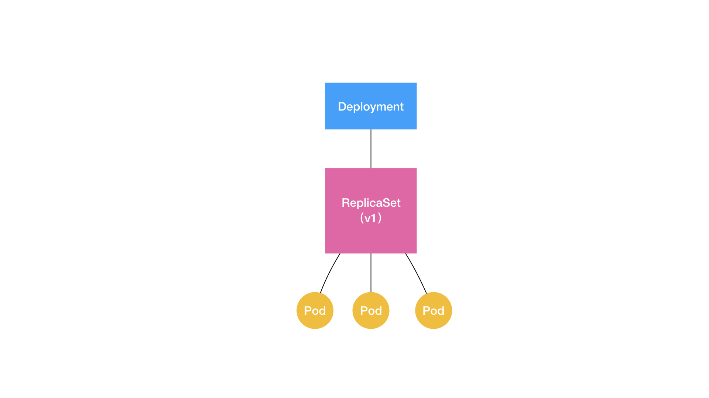

# 容器与容器编排

## 1. 容器

### 1.1 容器的定位

* 功能
  * **屏蔽运行环境的差异、应用间未隔离**，对应用部署运行的影响。（省去因环境不同而引入问题的成本）
  * 进而，提出的一种**将环境依赖和应用一起打包**成“集装箱”，并对不同应用进行**隔离**和对容器**限制**的模式。从而保证了即使运行在不同环境，还能保持一致的行为。

* 与虚拟机的不同之处
  * 虚拟机
    * 运行一个完整的 Guest OS 才能执行用户的应用进程，不可避免地带来了额外的资源消耗和占用
    * 虚拟机上的应用对操作系统的调用要经过虚拟化软件进行拦截和处理，转为真正宿主机上的系统调用
  * 容器
    * 一种通过namespace和cgroups进行隔离和限制的“特殊”进程，本质还是普通进程，没有虚拟化而带来的性能损耗，系统调用上，于其他进程无差异。
    * 性能优势
    * 缺点：隔离不彻底
      * 容器只是运行在宿主机上的一种特殊的进程，那么多个容器之间使用的就还是同一个宿主机的操作系统内核
        1. 有很多资源和对象是不能被 Namespace 化的（时间）
           * 你的容器中的程序使用 settimeofday(2) 系统调用修改了时间，整个宿主机的时间都会被随之修改
        2. 无法低版本的 Linux 宿主机上运行高版本的 Linux 容器
        3. 配置内核参数、加载额外的内核模块，以及跟内核进行直接的交互,操作的是宿主机操作系统的内核

### 1.2 需解决的问题及实现

#### 1.2.1 **环境隔离（NameSpace）**

* 通过**Linux  NameSpace**技术，对 PID、Mount、UTS、IPC、Network 和 User进行隔离，达到隔离的应用只能看到当前NameSpace下的信息。

* | 分类                   | 系统调用参数  | 相关内核版本                                                 |
  | :--------------------- | :------------ | :----------------------------------------------------------- |
  | **Mount namespaces**   | CLONE_NEWNS   | [Linux 2.4.19](http://lwn.net/2001/0301/a/namespaces.php3)   |
  | **UTS namespaces**     | CLONE_NEWUTS  | [Linux 2.6.19](http://lwn.net/Articles/179345/)              |
  | **IPC namespaces**     | CLONE_NEWIPC  | [Linux 2.6.19](http://lwn.net/Articles/187274/)              |
  | **PID namespaces**     | CLONE_NEWPID  | [Linux 2.6.24](http://lwn.net/Articles/259217/)              |
  | **Network namespaces** | CLONE_NEWNET  | [始于Linux 2.6.24 完成于 Linux 2.6.29](http://lwn.net/Articles/219794/) |
  | **User namespaces**    | CLONE_NEWUSER | [始于 Linux 2.6.23 完成于 Linux 3.8)](http://lwn.net/Articles/528078/) |

* 涉及系统调用

  * **`clone`**() – 用来创建一个新的进程，并可以通过设计上述参数达到隔离。
  * **`unshare`**() – 使某进程脱离某个namespace,创建且加入新的 namespace
  * **`setns`**() – 把某进程加入到某个namespace。（注：**docker exec** 就是通过此系统调用加入对应容器的namespace实现）

* 命令行操作

  * 进入某个进程的namespace

    * ```
      nsenter -t ${pid} -i -m -n -p -u
      ```

* **`clone`**()使用 namespace 例子：

  * 基本代码（下列的例子都是通过在此代码基础上调整 main函数中clone的flag，和container_main函数即可）

    * ```
      #define _GNU_SOURCE
      #include <sys/types.h>
      #include <sys/wait.h>
      #include <stdio.h>
      #include <sched.h>
      #include <signal.h>
      #include <unistd.h>
      /* 定义一个给 clone 用的栈，栈大小1M */
      #define STACK_SIZE (1024 * 1024)
      static char container_stack[STACK_SIZE];
      char* const container_args[] = {
          "/bin/bash",
          NULL
      };
      int container_main(void* arg)
      {
          printf("Container - inside the container!\n");
          /* 直接执行一个shell，以便我们观察这个进程空间里的资源是否被隔离了 */
          execv(container_args[0], container_args); 
          printf("Something's wrong!\n");
          return 1;
      }
      int main()
      {
          printf("Parent - start a container!\n");
          /* 调用clone函数，其中传出一个函数，还有一个栈空间的（为什么传尾指针，因为栈是反着的） */
          int container_pid = clone(container_main, container_stack+STACK_SIZE, SIGCHLD, NULL);
          /* 等待子进程结束 */
          waitpid(container_pid, NULL, 0);
          printf("Parent - container stopped!\n");
          return 0;
      }
      ```

  * UTS Namespace

    * ```
      int container_main(void* arg)
      {
          printf("Container - inside the container!\n");
          sethostname("container",10); /* 设置hostname */
          execv(container_args[0], container_args);
          printf("Something's wrong!\n");
          return 1;
      }
      int main()
      {
          printf("Parent - start a container!\n");
          int container_pid = clone(container_main, container_stack+STACK_SIZE, 
                  CLONE_NEWUTS | SIGCHLD, NULL); /*启用CLONE_NEWUTS Namespace隔离 */
          waitpid(container_pid, NULL, 0);
          printf("Parent - container stopped!\n");
          return 0;
      }
      ```

      * 运行上面的程序你会发现（需要root权限），子进程的hostname变成了 container

      * ```
        root@container:~# hostname
        container
        root@container:~# uname -n
        container
        ```

  * PID namespaces

    * ```
      int container_main(void* arg)
      {
          /* 查看子进程的PID，我们可以看到其输出子进程的 pid 为 1 */
          printf("Container [%5d] - inside the container!\n", getpid());
          sethostname("container",10);
          execv(container_args[0], container_args);
          printf("Something's wrong!\n");
          return 1;
      }
      int main()
      {
          printf("Parent [%5d] - start a container!\n", getpid());
          /*启用PID namespace - CLONE_NEWPID*/
          int container_pid = clone(container_main, container_stack+STACK_SIZE, 
                  CLONE_NEWUTS | CLONE_NEWPID | SIGCHLD, NULL); 
          waitpid(container_pid, NULL, 0);
          printf("Parent - container stopped!\n");
          return 0;
      }
      ```

      * 查看运行结果

        ```
        echo $$ 
        1
        ```
        
      * 说明：此时进程的ID已经是1了，但是为什么ps还是可以看到所有的进程呢？（因为没有挂载/proc目录）
      
        * ps命令是解析procfs的内容得到结果的，而procfs根目录的进程pid目录是基于mount当时的pid namespace的，这个在procfs的get_sb回调中体现的。因此只需要重新mount一下proc, mount -t proc proc /proc*/

  * Mount namespaces

    * ```
      int container_main(void* arg)
      {
        printf("Container - inside the container!\n");
        // 如果你的机器的根目录的挂载类型是 shared，那必须先重新挂载根目录
        // mount("", "/", NULL, MS_PRIVATE, "");
        mount("none", "/tmp", "tmpfs", 0, "");
        execv(container_args[0], container_args);
        printf("Something's wrong!\n");
        return 1;
      }
      ```

    * ```
      ls /tmp
      ```

* NameSpace实现

  * 使用
    * 用 clone() 系统调用创建一个新进程时，就可以在参数中指定 CLONE_NEWPID 参数，选择是否开启一个新的namespace
  * 原理分析（待补充）
    * 

#### 1.2.2 **限制（Cgroups）**

* 额外说明：

  * 当前描述的版本为cgroups-v1，也是大多数生产环境使用的版本，使用简单，但管理上特别是层级复杂且多的时候不易管理，后续推出了v2版本 见以下链接
    * 推出v2版本的原因：https://lwn.net/Articles/484251/
    * v2版本unified control group hierarchy：https://lwn.net/Articles/601840/

* 引入限制的原因

  * 因为本质还是宿主机上的普通进程，那么还是会和其他进程存在资源相互抢占的情况，为了避免容器进程与其他进程间的相互影响，引入了资源限制这一功能（通过**Cgroups**实现）

* **Linux Cgroups** （**Linux Control Group**）

  * 功能

    * **限制一个进程组能够使用的资源上限，包括 CPU、内存、磁盘、网络带宽**
    * 优先级设置、审计、将进程挂起和恢复等
    * 注：Cgroup CPU 它只能限制进程的CPU使用，对于IO、软中断、硬中断的耗时（wa、hi、si），无法限制。因为这一部分的处理不属于任何进程。

  * 概述

    * Cgroups 通过文件系统的形式提供限制的功能，即它以文件和目录的方式组织在操作系统的 /sys/fs/cgroup 路径下

    *  /sys/fs/cgroup 下的目录结构

      * ```
        [root@VM_0_4_centos cgroup]# ls
        blkio    cpu,cpuacct  freezer  net_cls           perf_event
        cpu      cpuset       hugetlb  net_cls,net_prio  pids
        cpuacct  devices      memory   net_prio          systemd
        ```

      * 表示可以被限制的类型有哪些: cpuset、cpu、 memory 等

    * /sys/fs/cgroup/cpu下的目录结构

    * ```
      $ ls /sys/fs/cgroup/cpu
      cgroup.clone_children cpu.cfs_period_us cpu.rt_period_us  cpu.shares notify_on_release
      cgroup.procs      cpu.cfs_quota_us  cpu.rt_runtime_us cpu.stat  tasks
      ```

      * 表示cpu可以被具体控制的参数有哪些 cpu.cfs_period_us （cpu周期，单位us，默人100ms） 、cpu.cfs_quota_us（使用的cpu，单位us，默人不限制-1），
        * 这两个参数需要组合使用，可以用来限制进程在长度为 cfs_period 的一段时间内，只能被分配到总量为 cfs_quota 的 CPU 时间。
          * 如cpu.cfs_quota_us设置成20ms，则表示100ms内最多只能分配到100ms的cpu执行时间，即最高占用cpu 20%

  * 使用

    1. 在需要资源限制的目录下面创建文件夹

       * 如：想对cpu进行限制，则在Cpu下面创建一个文件夹（**即：创建一个控制组**）

         * ```
           /sys/fs/cgroup/cpu$ mkdir container
           ```

       * 此时，创建的文件夹下，自动会生成对应的文件如下所示

         * ```
           root@ubuntu:/sys/fs/cgroup/cpu$ ls container/
           cgroup.clone_children cpu.cfs_period_us cpu.rt_period_us  cpu.shares notify_on_release
           cgroup.procs      cpu.cfs_quota_us  cpu.rt_runtime_us cpu.stat  tasks
           ```

         * 即与之前/sys/fs/cgroup/cpu下的内容一致

    2. 可对此控制组进行资源限制

       * 如cpu.cfs_quota_us设置成20ms，则表示100ms内最多只能分配到100ms的cpu执行时间，即最高占用cpu 20%

         * ```
           $ echo 20000 > /sys/fs/cgroup/cpu/container/cpu.cfs_quota_us
           ```

         * 此时，此控制组下的任务cpu使用率最高为20%

    3. 添加进程到此控制组，进行限制

       * ```
         echo ${pid} > /sys/fs/cgroup/cpu/container/tasks 
         ```

         * ${pid} 即为要限制的进程pid，此时限制已生效，进程此时的cpu最高使用率为20%

       * 验证是否生效

         * 后台执行脚本（死循环），进程id：1186

           ```
           while : ; do : ; done &
           [1] 1186
           ```

         * 查看cpu系统占用为100%

         * 执行 echo  1186 > /sys/fs/cgroup/cpu/container/tasks （把此进程加入上述添加的限制组中）

         * 查看系统占用为20%，说明资源限制生效

  * docker 中的使用：

    * ```
      docker run -it --cpu-period=100000 --cpu-quota=20000 ubuntu /bin/bash
      ```

      * -it 参数告诉了 Docker 项目在启动容器后，需要给我们分配一个文本输入 / 输出环境，也就是 TTY，跟容器的标准输入相关联

    * 查看是否生效

      * ```
        $ cat /sys/fs/cgroup/cpu/docker/5d5c9f67d/cpu.cfs_period_us 
        100000
        $ cat /sys/fs/cgroup/cpu/docker/5d5c9f67d/cpu.cfs_quota_us 
        20000
        ```

* 原理概述 

  * 1. 首先是cgroup的初始化，在系统初始化start_kernel()时发生。

    * **主要的作用**：初始化 cgroup 的各个子系统的操作函数，分配各个子系统的数据结构

      1. 包括对于数组cgroup_subsys内每一项**创建cgroup_subsys_state** (通过调用各自的css_alloc方法生成，实际真正类型各不相同，cpu为task_group结构体，含有一些调度相关的变量，如sched_entity等，memory为mem_cgroup含内存分配相关，可以把cgroup_subsys_state理解为基类，task_group和mem_cgroup为子类是对基类的扩展，只不过C中是通过指针强制类型转换实现) 和**激活cgroup**（通过调用各自css_online方法激活）。
      2. 初始化 cgroup 文件类型 cftype 的操作函数，将 struct kernfs_ops *kf_ops 设置为 cgroup_kf_ops，供挂载文件系统和操作文件使用

      * cgroup_subsys 每一项对应/sys/fs/cgroup目录下的每一项（如：cpu：memory等）

      * ```
      cpu_cgrp_subsys
        struct cgroup_subsys cpu_cgrp_subsys = {
        	.css_alloc	= cpu_cgroup_css_alloc,
        	.css_online	= cpu_cgroup_css_online,
      	  .css_released	= cpu_cgroup_css_released,
        	.css_free	= cpu_cgroup_css_free,
        	.fork		= cpu_cgroup_fork,
        	.can_attach	= cpu_cgroup_can_attach,
        	.attach		= cpu_cgroup_attach,
        	.legacy_cftypes	= cpu_files,
        	.early_init	= true,
        };
         
        memory_cgrp_subsys
        struct cgroup_subsys memory_cgrp_subsys = {
        	.css_alloc = mem_cgroup_css_alloc,
        	.css_online = mem_cgroup_css_online,
        	.css_offline = mem_cgroup_css_offline,
        	.css_released = mem_cgroup_css_released,
        	.css_free = mem_cgroup_css_free,
        	.css_reset = mem_cgroup_css_reset,
        	.can_attach = mem_cgroup_can_attach,
        	.cancel_attach = mem_cgroup_cancel_attach,
        	.post_attach = mem_cgroup_move_task,
        	.bind = mem_cgroup_bind,
        	.dfl_cftypes = memory_files,
        	.legacy_cftypes = mem_cgroup_legacy_files,
        	.early_init = 0,
        };
        ```

  * 2. mount cgroup 文件系统，创建文件系统的树形结构，以及操作文件的函数
       * 对于不同的类型，这里的op操作指针指向不同的函数，达到写cpu下的文件和写memory的文件，调用不同的函数，对于同个cpu下的不同参数如cfs_quota_us和cfs_period_us也是不同的函数调用

  * 3. 写入 cgroup 文件，设置 cpu 或者 memory 的相关参数，这个时候文件系统的操作函数会调用到 cgroup 子系统的操作函数，从而将参数设置到 cgroup 子系统的数据结构中

  * 4. 写入 tasks 文件，将进程交给某个 cgroup 进行管理，因为 tasks 文件也是一个 cgroup 文件，统一会调用文件系统的操作函数进而调用 cgroup 子系统的操作函数，将 cgroup 子系统的数据结构和进程关联起来

  * 5. 对于 cpu 来讲，可以修改实时调度任务和完全公平调度任务，以完全公平调度为例：会修改 scheduled entity，放入相应的队列里面去，从而下次调度的时候就起作用了。对于内存的 cgroup 设定，只有在申请内存的时候才起作用
       * scheduled entity结构体说明：
         * 这个是完全公平调度算法的调度实体，是绝大多数进程的调度算法，此结构体就是记录进程的执行调度情况，包括vruntime运行时间、权重等统计，是linux调度队列（是个红黑树 ）上的节点，与进程task_struct 一一对应。

  * 通俗易懂版本总结：

    1. 如果你对linux中的一切皆文件，这个概念有一定了解，那么就可以很好的理解这部分的功能。

       * 一切皆文件解释（其实就是一种面向接口和协议编程，解耦接口（协议）与实现的思想）：

         * linux有个VFS虚拟文件系统层，定义了open、write、read等一些操作接口，在挂载具体的文件系统时，就会确定这些接口的具体实现函数，那么在创建文件和操作文件时，与这些具体实现函数相关联，就做到了虽然在上层调用都是write，但不同的文件关联的可能是不同函数，达到写文件实际执行不同操作的功能。（注：当然一些设备的操作无法通过上述通用的操作接口去执行，所以就定义了一个ioctl接口的扩展，具体可自行了解）

         * 【课外延伸】：
           * mysql架构：
             * 这个就跟mysql的架构体系很像，定义了server层和存储引擎层，对于所有存储引擎层（如：innodb、mysiam等），server层不需要关心你的实现，我定义了统一的接口，存储引擎层去实现即可接入。

    2. 对文件夹CPU、Memory等的创建等操作指向的是不同函数，所以创建的不同内容，对于CPU下的文件cpu.cfs_quota_us、cpu.cfs_period_us指向的也是不同函数，我只要在函数里实现相应的功能，如CPU运行时间的限制，就通过生成一个Task Group内含有调度对象，在对象里限制调度，并与tasks下的进程相关联，如Memory内存分配，生成一个memory Group，与tasks下的进程相关联，在内存分配时获取这个结构，判断是否可以分配内存，达到限制的功能。

* Memory Cgroup限制【课外延伸】

  * memory.limit_in_bytes后对page cache的影响
    * 如我设置了memory.limit_in_bytes =1G，此时容器内RSS占用500M, page cache 占用480M（即 memory.usage_in_bytes =980M,已使用980M），此时再分配50M内存时，会执行什么操作
  * memory.limit_in_bytes后对swap的影响
    * 如我设置了memory.limit_in_bytes =1G，此时容器内RSS占用950M,，此时再分配50M内存时（以开启Swap，大小3G），会执行什么操作

#### 1.2.3 环境依赖的一致性保证（切换进程的根目录）

* 如何保证环境依赖的一致？

  * 只要我依赖的lib、配置、目录、文件一致是不是就意味着环境一致。
  * 所以只要我挂载的根目录文件系统rootfs每次都相同，就可以保证我的环境一致。

* 解决方案

  * 为容器进程挂载一个新的rootfs与原宿主机上的rootfs隔离，且运行时都挂载相同的文件系统，即可保证环境一致。

  * Mount Namespace

    * <span name = "说明">说明</span>

      * 用 clone() 创建进程并设置开启了mount namespace时，父进程会把自己的**文件结构复制给子进程**中。而**子进程需要重新挂载才能生效（不然还是用父进程里复制来的文件结构），且子进程新的namespace中的所有mount操作都只影响自身的文件系统，而不对宿主机不会产生任何影响**

    * 通过Mount Namespace隔离挂载一个完整的操作系统**rootfs（根文件系统）**，即切换进程的根目录至新的完整操作系统的文件和目录，可实现上述的环境和依赖保持一致。这里的rootfs即为我们所说的**“容器镜像”**。会包括如下所示的一些目录和文件，比如 /bin，/etc，/proc 等等

      * 注：**rootfs 只是一个操作系统所包含的文件、配置和目录并不包括操作系统内核。在 Linux 操作系统中，这两部分是分开存放的，操作系统只有在开机启动时才会加载指定版本的内核镜像**，所以会存在配置内核参数影响全局的情况

      * ```
        $ ls /
        bin dev etc home lib lib64 mnt opt proc root run sbin sys tmp usr var
        ```

    * 【课外阅读】

      * 因为mount namespace间存在隔离，对于一个新的disk，如果多个namespace都需要可见，那么对于每个namespace都需要执行下mount的操作，有没有什么解决方案呢

        * #### Shared subtrees

* 还需要解决的问题：

  * 多容器对rootfs（完整操作系统文件和目录）的复用性问题，需做到复用且又隔离互不影响
  * 解决方案：**分层（layer）设计**	

* **分层（layer）设计**	

  * 概述：

    * 对于公共不变化的部分，保持只读 （**只读层**）；对于变化（增量写入操作的部分），保持读写（**读写层**）；再将这样的**文件进行叠加，给用户展现叠加后的最终的rootfs视图**，这样就做到了复用与隔离。
    * 实际上还有一层**Init 层**，**用来存放启动容器时的值，这类数据有个特点，与镜像无关，仅本次容器启动生效，执行docker commit时，也不会提交**。

  * 对于叠加功能的实现，需要**联合文件系统（Union File System**）的能力

    * 功能

      * 将多个不同位置的目录联合挂载（union mount）到同一个目录下

    * 例子：

      * 文件当前目录

        * ```
          $ tree
          .
          ├── A
          │  ├── a
          │  └── x
          └── B
            ├── b
            └── x
          ```

      * 联合两个目录A、B到C目录下

        * ```
          $ mkdir C
          $ mount -t aufs -o dirs=./A:./B none ./C
          $ tree ./C
          ./C
          ├── a
          ├── b
          └── x
          ```

        * 即完成了目录的合并

* Docker中的**联合文件系统（Union File System**）

  * 如果是**AuFS**实现的联合文件系统目录结构在 /var/lib/docker 路径下的 diff 目录	

    * ```
      /var/lib/docker/aufs/diff/<layer_id>
      ```

  * 通过查看挂载的方式，查看具体使用的联合文件系统

    * ```
      cat /proc/mounts
      ```

  * 例子实践

    1. 启动一个容器

       * ```
         docker run -d ubuntu:latest sleep 3600
         ```

       * 此时Docker 就会从 Docker Hub 上拉取一个 Ubuntu 镜像（ Ubuntu 操作系统的所有文件和目录）到本地，通过如下命令查看

         * ```
           $ docker image inspect ubuntu:latest
           ...
                "RootFS": {
                 "Type": "layers",
                 "Layers": [
                   "sha256:f49017d4d5ce9c0f544c...",
                   "sha256:8f2b771487e9d6354080...",
                   "sha256:ccd4d61916aaa2159429...",
                   "sha256:c01d74f99de40e097c73...",
                   "sha256:268a067217b5fe78e000..."
                 ]
               }
           ```

         * 此时有五个增量 rootfs，每一层都是 Ubuntu 操作系统文件与目录的一部分；而在使用镜像时，Docker 会把这些增量联合挂载在一个统一的挂载点上，即 **/var/lib/docker/aufs/mnt/**路径（**AuFS**实现的联合文件系统下才是这个路径）

         * 具体以docker版本为准，通过**docker image inspect ${container_id}**查看

           * ```
             笔者环境:为"MergedDir"路径
             $ docker inspect a06f395c54a5 
             ···
             "GraphDriver": {
                         "Name": "overlay2",
                         "Data": {
                             "LowerDir": "/var/lib/docker/overlay2/26b570d4e3f93a9158864d4b29a0b528e16d410b87bacf723588ff75736fb464-init/diff:/var/lib/docker/overlay2/100048e4650f53dbebccdbf03121694a98fba0b7c5c950d933227a8c247a8d24/diff",
                             "MergedDir": "/var/lib/docker/overlay2/26b570d4e3f93a9158864d4b29a0b528e16d410b87bacf723588ff75736fb464/merged",
                             "UpperDir": "/var/lib/docker/overlay2/26b570d4e3f93a9158864d4b29a0b528e16d410b87bacf723588ff75736fb464/diff",
                             "WorkDir": "/var/lib/docker/overlay2/26b570d4e3f93a9158864d4b29a0b528e16d410b87bacf723588ff75736fb464/work"
                         }
                     },
             ···
             ```

           * 此路径下即为完整的 Ubuntu 操作系统

             

  * <span name="123rootfs层级结构">**Docker rootfs层级结构**</span>

    * 
    * **只读层**
      * 它们的挂载方式都是只读的（ro+wh，即 readonly+whiteout）
        * whiteout说明：
          * 因为是增量覆盖，所以对于删除的支持，需要特殊处理，为了实现这样的删除操作，AuFS 会在可读写层创建一个 whiteout 文件，把只读层里的文件“遮挡”起来，达到删除的功能
    * **可读写层**
      * 它的挂载方式为：rw，即 read write。在没有写入文件之前，这个目录是空的。而一旦在容器里做了写操作，你修改产生的内容就会以增量的方式出现在这个层
      * 可以使用 docker commit 和 push 指令，保存这个被修改过的可读写层，并上传到 Docker Hub 上
    * **Init 层**
      * 以“-init”结尾的层，夹在只读层和读写层之间。Init 层是 Docker 项目单独生成的一个内部层，专门用来存放 /etc/hosts、/etc/resolv.conf 等信息
      * 用户往往需要在**启动容器**时写入一些指定的值比如 hostname，所以就需要在可读写层对它们进行修改。
      * **用户执行 docker commit 只会提交可读写层，是不包含这些内容的**
    * 说明：
      * 最终,联合挂载到对应目录下，通过相同的文件上层会覆盖掉下层。所以通过上层读写层，init层覆盖一层一层覆盖的方式，达到隔离和复用的效果

#### 1.2.4 容器内外目录映射（**Volume 机制**）

* 功能：容器对宿主机文件的读取和修改，并且在docker commit时，不会提交挂载文件

* 实现方式

  * 通过在创建mount namespace之后，挂载文件切换进程根目录之前，执行 mount bind 操作将向映射文件，挂载到容器目标路径下。（因此时还未挂载文件，可以读到宿主机文件路径，且开启了mount namespace挂载对宿主机无感知，不会影响宿主机，<a href="#说明">详见1.2.3环境依赖的一致性保证-解决方案-mount space说明</a>)

*  mount bind

  * 说明
    * 将一个目录或者文件，挂载到一个指定的目录上。并且，这时你在该挂载点上进行的任何操作，只是发生在被挂载的目录或者文件上，而原挂载点的内容则会被隐藏起来且不受影响。
    * 
    * 相当于将 /test 的 dentry，重定向到了 /home 的 inode。这样当我们修改 /test 目录时，实际修改的是 /home 目录的 inode。这也就是为何，一旦执行 umount 命令，/test 目录原先的内容就会恢复：因为修改真正发生在的，是 /home 目录里。

* docker commit不会提交挂载文件的解释

  * commit发生在宿主机空间，是对**容器rootfs在宿主机实际的文件路径**下的读写层的提交（如联合文件系统为**AuFS**时，路径：/var/lib/docker/aufs/diff, <a href="#123rootfs层级结构">详见1.2.3环境依赖的一致性保证-Docker rootfs层级结构</a>）。而由于 Mount Namespace 的隔离作用，宿主机并不知道这个/test文件路径重新被 mount bind到了/home下（开启了mount namespace 所以mount操作对宿主机隔离，只在容器内生效），所以看到的是个空的/test文件夹，所以不会提交挂载的文件。

* 例子验证

  * 启动容器，挂载/test文件夹，并在此路径下创建文件

    * ```
      $ docker run -it -v /test busybox /bin/sh
        touch /test/text.txt
      ```

    * 对于没有指定宿主机挂载位置的数据卷，挂载的默认路径为  **/var/lib/docker/volumes/[VOLUME_ID]/_data**

  * 查看挂载卷下是否有此文件（预期：有）

    * ```
      $ docker volume ls
      DRIVER              VOLUME NAME
      local               966520d40b36cc345a88814
      
      $ ls /var/lib/docker/volumes/966520d40b36cc345a88814/_data/
      text.txt
      ```

    * 可以通过docker volume ls命令获取VOLUME ID，默认路径为/var/lib/docker/volumes/[VOLUME_ID]/_data/

    * 也可以直接通过命令 docker inspect ${container_id}获取

  * 查看容器rootfs在宿主机实际的文件路径下是否有此文件（预期：无）

    * ```
      $ docker inspect b7b5922db1cf
      ···
       "MergedDir": "/var/lib/docker/overlay2/9e42bf5e2f7aabe5dc15a0fe0846a5874f530eedf3481189096b236c210b0db8/merged",
      ···
      [root@VM_0_4_centos ~]# cd /var/lib/docker/overlay2/9e42bf5e2f7aabe5dc15a0fe0846a5874f530eedf3481189096b236c210b0db8/merged/test
      [root@VM_0_4_centos test]# ll
      总用量 0
      ```

    * 通过docker inspect ${container_id}获取 rootfs路径，查看路径下的/test文件夹，不存在text.txt，与预期一致，验证完毕。

    * 如果docker版本用的是Aufs联合文件系统，rootfs默认路径为/var/lib/docker/aufs/mnt下

### 1.3 Docker使用

#### 1.3.1 Dockerfile （**制作容器镜像**）

* 实现
  * **使用一些标准的原语（即大写高亮的词语），描述我们所要构建的 Docker 镜像。并且这些原语，都是按顺序处理**
    * **Dockerfile 中的每个原语执行后，都会生成一个对应的镜像层**。即使原语本身并没有明显地修改文件的操作（比如，ENV 原语），它对应的层也会存在。只不过在外界看来，这个层是空的

* 例子

  * ```
    # 使用官方提供的 Python 开发镜像作为基础镜像,免去了安装 Python 等语言环境
    FROM python:2.7-slim
     
    # 将工作目录切换为 /app,Dockerfile 后面的操作都以这一句指定的 /app 目录作为当前目录。
    WORKDIR /app
     
    # 将当前目录下的所有内容复制到 /app 下
    ADD . /app
     
    # 使用 pip 命令安装这个应用所需要的依赖
    RUN pip install --trusted-host pypi.python.org -r requirements.txt
     
    # 允许外界访问容器的 80 端口
    EXPOSE 80
     
    # 设置环境变量
    ENV NAME World
     
    # 设置容器进程为：python app.py，即：这个 Python 应用的启动命令
    CMD ["python", "app.py"]
    ```

    * RUN 原语就是在容器里执行 shell 命令
    *  ENTRYPOINT 的原语。实际上，它和 CMD 都是 Docker 容器进程启动所必需的参数，完整执行格式是：“ENTRYPOINT CMD”
      * 默认情况下，Docker 会为你提供一个隐含的 ENTRYPOINT，即：/bin/sh -c。所以，在不指定 ENTRYPOINT 时，比如在我们这个例子里，实际上运行在容器里的完整进程是：/bin/sh -c “python [app.py](http://app.py)”，即 CMD 的内容就是 ENTRYPOINT 的参数
      * 基于以上原因，**我们后面会统一称 Docker 容器的启动进程为 ENTRYPOINT，而不是 CMD**

### 1.3 容器中的进程

#### 1.3.1 容器中kill PID=1的杀不死问题

* **问题描述**：

  * kill pid=1进程，时而可以kill，时而不能kill，但kill -9 一定杀不死 pid=1 进程

* 场景：

  * 在k8s里，他想修改容器镜像里的一个 bug，但因为网路配置的问题，这个同学又不想为了重建 pod 去改变 pod IP。如果你用过 Kubernetes 的话，你也肯定知道，Kubernetes 上是没有restart pod这个命令的。这样看来，他似乎只能让 pod 做个原地重启了。当时我首先想到的，就是在容器中使用 kill pid 1 的方式重启容器。

* 背景知识

  * **init 进程（pid =1进程）**

    * 启动时，在内核完成了操作系统的各种初始化之后，这个程序需要执行的第一个用户态程就是 init 进程。系统启动的时候先是执行内核态的代码，然后在内核中调用 1 号进程的代码，从内核态切换到用户态。
      * 目前主流的 Linux 发行版，会把 /sbin/init 作为符号链接指向 Systemd。Systemd 是目前最流行的 Linux init 进程，在它之前还有SysVinit、UpStart 等 Linux init 进程。
    * 无论是哪种 Linux init 进程，它**最基本的功能都是创建出 Linux 系统中其他所有的进程，并且管理这些进程**。

  * **kill （信号）**

    * 概念：kill命令其实就是发送一个信号，信号从1开始编号，依次递增，可通过kill -l 查看当前支持信号。而**信号（Signal）其实就是 Linux 进程收到的一个通知**

      * 信号使用例子
        * 如果我们按下键盘“Ctrl+C”，当前运行的进程就会收到一个信号 SIGINT 而退出；
        * 如果我们的代码写得有问题，导致内存访问出错了，当前的进程就会收到另一个信号SIGSEGV；
        * 可以通过命令 kill <pid>，直接向一个进程发送一个信号，缺省情况下不指定信号的类型，那么这个信号就是 SIGTERM。也可以指定信号类型，比如命令“kill -9<pid>”, 这里的 9，就是编号为 9 的信号，SIGKILL 信号。

    * 信号处理类型：

      * **忽略（Ignore）**，就是对这个信号不做任何处理，但是有两个信号例外，对于 **SIGKILL 和 SIGSTOP** 这个两个信号，进程是不能忽略的，只能执行系统的缺省行为。这是因为它们的主要作用是为 Linux kernel 和超级用户提供删除任意进程的特权。

      * **捕获（Catch）**，这个是指让用户进程可以注册自己针对这个信号的handler

      * **缺省行为（Default）**，Linux 为每个信号都定义了一个缺省的行为，你可以在 Linux 系统中运行man7signal来查看每个信号的缺省行为。

      * 

      * kill系统调用

        * kill调用有个方法 sig_task_ignored（），里面有一旦这三个子条件都被满足，那么这个信号就不会发送给进程。

          * SIGKILL and SIGSTOP 不会被发送给init进程

          * 只有内核才能发送信号给kthread进程

          * (unlikely(*t*->signal->flags & SIGNAL_UNKILLABLE) &&

            handler == SIG_DFL && !(*force* && sig_kernel_only(*sig*)))

            *  !(*force* && sig_kernel_only(*sig*))
              * 条件里 force 的值，对于同一个 Namespace 里发出的信号来说，调用值是 0，所以这个条件总是满足的。
            * unlikely(*t*->signal->flags & SIGNAL_UNKILLABLE)
              * 在每个 Namespace 的 init 进程建立的时候，就会打上SIGNAL_UNKILLABLE这个标签，也就是说只要是 1 号进程，就会有这个 flag，这个条件也是满足的。
            * handler == SIG_DFL
              * 判断信号的 handler是否是默认缺省处理方式，即信号处理类型为：缺省行为（Default）。

* 现象解释：

  * 从kill系统调用中可以发现，kill -9 1号进程肯定满足上述信号忽略发送3个子条件，所以会被忽略，所以kill -9 杀不死1号进程。
  * 而为什么kill 1 有时候能杀死，有时候不行呢，其实取决于容器内的pid =1 的应用进程，是否注册了信号sigterm的处理方式（kill 默认发送的信号为sigterm），注册了，则handler == SIG_DFL条件不满足，不是默认处理行为，则会发送信号给1号进程，所以当注册了sigterm时，可以kill 15号进程；不注册，也kill不了1号进程。

* **结论**：

  * Linux 内核针对每个Nnamespace 里的 init 进程，把只有 default handler 的信号都给忽略了。

* 现象验证：

  * 查看 1 号进程状态中 SigCgt Bitmap。

    * ```
      # cat /proc/1/status|grep -i SigCgt
      SigCgt: 0000000000010002
      ```

      * 查看1号进程的status状态，里面有SigCgt Bitmap
      * SigCgt解析
        * 0000000000010002是十六进制数，将其从十六进制转换为二进制，则每个1位代表捕获的信号
        * 000...0010,000,000,000,000,010
          * 所以上述的用户注册了的handler信号是信号2信号17，这两个注册了handler（位数对应的即为该信号的值）。


## 2.容器编排（Kubernetes）

### 2.1 K8s的前世今生(待补充完善)

* 解决的问题
  * 编排、调度、容器云、集群管理
* 用户层面需要的功能
  * 功能
    * 给定的集群运行应用
    * 运维能力（路由网关、水平扩展、监控、备份、灾难恢复等）
  * 经典 PaaS的能力都具备此功能，更别说Docker Swarm ，那么K8s的优势在哪
    * 解决了**集群间任务关系的定义和处理**
      * 运行在大规模集群中的各种任务之间，实际上存在着各种各样的关系。这些关系的处理，才是作业编排和管理系统最困难的地方

### 2.2 K8s的设计架构(待补充完善)

* 架构
  * 
* Master 节点（控制节点）
  * 负责 API 服务的 kube-apiserver
  * 负责调度的 kube-scheduler，
  * 以及负责容器编排的 kube-controller-manager。
  * 注：整个集群的持久化数据，则由 kube-apiserver 处理后保存在 Etcd 中
* 计算节点
  * kubelet
    * **主要负责同容器运行时（比如 Docker 项目）打交道**
      * 交互依赖于CRI（Container Runtime Interface）的远程调用接口
        * 
        * 这个接口定义了容器运行时的各项核心操作，比如：启动一个容器需要的所有参数。
        * 这也是为何，Kubernetes 项目并不关心你部署的是什么容器运行时、使用的什么技术实现，只要你的这个容器运行时能够运行标准的容器镜像，它就可以通过实现 CRI 接入到 Kubernetes 项目当中
        * 比如 Docker 项目，则一般通过 OCI 这个容器运行时规范同底层的 Linux 操作系统进行交互，即：把 CRI 请求翻译成对 Linux 操作系统的调用（操作 Linux Namespace 和 Cgroups 等）
    * **通过 gRPC 协议同一个叫作 Device Plugin 的插件进行交互**
      * Device Plugin
        * Kubernetes 项目用来管理 GPU 等宿主机物理设备的主要组件，也是基于 Kubernetes 项目进行机器学习训练、高性能作业支持等工作必须关注的功能
    * **调用网络插件和存储插件为容器配置网络和持久化存储**
      * 交互接口CNI（Container Networking Interface）和 CSI（Container Storage Interface）

#### 2.2.1 API Server

* 介绍

  * 提供Kubernetes各类资源对象（如Pod、RC、Service等）的增、删、改、查及Watch等**HTTP Rest接口**。成为集群内各个**功能模块之间数据交互和通信**的中心枢纽，是整个系统的**数据总线和数据中心**。(**本身也是一个Service，它的名称就是kubernetes**)

* **核心功能**

  * 集群管理的API入口
  * 资源配额控制的入口
  * 提供完备的集群安全机制

* **交互的方式**

  * **命令行工具kubectl**

    * 创建

      * ```
        $ kubectl create -f 我的配置文件
        ```

    * 查询API对象

      * ```
        $ kubectl get pods -l app=nginx
        NAME                                READY     STATUS    RESTARTS   AGE
        nginx-deployment-67594d6bf6-9gdvr   1/1       Running   0          10m
        nginx-deployment-67594d6bf6-v6j7w   1/1       Running   0          10m
        ```

        *  -l 参数，即获取所有匹配 app: nginx 标签的 Pod

    * 查看API 对象的细节

      * ```
        $ kubectl describe pod nginx-deployment-67594d6bf6-9gdvr
        Name:               nginx-deployment-67594d6bf6-9gdvr
        Namespace:          default
        Priority:           0
        PriorityClassName:  <none>
        Node:               node-1/10.168.0.3
        Start Time:         Thu, 16 Aug 2018 08:48:42 +0000
        Labels:             app=nginx
                            pod-template-hash=2315082692
        Annotations:        <none>
        Status:             Running
        IP:                 10.32.0.23
        Controlled By:      ReplicaSet/nginx-deployment-67594d6bf6
        ...
        Events:
         
          Type     Reason                  Age                From               Message
         
          ----     ------                  ----               ----               -------
          
          Normal   Scheduled               1m                 default-scheduler  Successfully assigned default/nginx-deployment-67594d6bf6-9gdvr to node-1
          Normal   Pulling                 25s                kubelet, node-1    pulling image "nginx:1.7.9"
          Normal   Pulled                  17s                kubelet, node-1    Successfully pulled image "nginx:1.7.9"
          Normal   Created                 17s                kubelet, node-1    Created container
          Normal   Started                 17s                kubelet, node-1    Started container
        ```

        * **Events（事件）**
          * 对 API 对象的所有**重要操作，都会被记录在这个对象的 Events 里**，并且显示在返回的结果中（异常排查的重要信息）
          * 上述例子
            * 被调度器调度（Successfully assigned）到了 node-1，拉取了指定的镜像（pulling image），然后启动了 Pod 里定义的容器（Started container）

    * 更新创建api对象（如：服务进行升级）

      * 修改配置文件后执行如下命令：

        * ```
          $ kubectl apply -f nginx-deployment.yaml
          ```

    * 进入容器

      * ```
        $ kubectl exec -it nginx-deployment-5c678cfb6d-lg9lw -- /bin/bash
        ```

    * 删除api对象

      * ```
        $ kubectl delete -f nginx-deployment.yaml
        ```

    * **tips**

      * **命令行中，所有 key-value 格式的参数，都使用“=”而非“:”表示**

  * HTTP（HTTPS）访问（默认端口8080，对应参数--insecure-port）

    * ```
      curl localhost:8080/api/vi
      ```

    * 想获取pods信息

      * curl localhost:8080/api/vi/pods

  * 编程方式调用

    * 使用场景
      * 运行在Pod里的用户进程调用Kubernetes API，通常用来实现分布式集群搭建的目标
      * 例子
        * 比如下面这段来自谷歌官方的Elasticsearch集群例子中的代码，Pod在启动的过程中通过访问Endpoints的API，找到属于elasticsearch-logging这个Service的所有Pod副本的IP地址，用来构建集群
        * 
      * 开发基于Kubernetes的管理平台（图形界面）

* 架构解析

  * 
  * API层：
    * 主要以REST方式提供各种API接口，除了有Kubernetes资源对象的CRUD和Watch等主要API，还有健康检查、UI、日志、性能指标等运维监控相关的API。Kubernetes从1.11版本开始废弃Heapster监控组件，转而使用Metrics Server提供Metrics API接口，进一步完善了自身的监控能力。
  * 访问控制层：
    * 当客户端访问API接口时，访问控制层负责对用户身份鉴权，验明用户身份，核准用户对Kubernetes资源对象的访问权限，然后根据配置的各种资源访问许可逻辑（Admission Control），判断是否允许访问。
  * 注册表层：
    * Kubernetes把所有资源对象都保存在注册表（Registry）中，针对注册表中的各种资源对象都定义了：资源对象的类型、如何创建资源对象、如何转换资源的不同版本，以及如何将资源编码和解码为JSON或ProtoBuf格式进行存储。

* **List-Watch机制（高性能的资源对象实时同步机制）**

  * 解决的问题：
    * 与etcd真正交互的只有api server 那么其他组件如何实时获取到对象实时变化的呢？
  * 流程
    * 
    * api server 监听etcd上的数据操作事件（如：pod创建、更新、删除事件）
    * api server 提供自己的watch接口，让相关组件订阅自己感兴趣的事件列表List。
    * 最后，客户端先从api server list接口 获取全量的数据，缓存于内存中，然后启动订阅资源的watch协程。这样在etcd通知api server后，apiserver根据此事件的watch list通知对应的组件。组件在收到watch事件后，根据事件对内存数据做相应的更改，实现全量结合增量的、高性能的、近乎实时的数据同步方式。

* **API对象不同版本之间的数据转换问题及API接口版本的兼容问题**

  * 例子：
    * 比如数据对象经历v1alpha1、v1beta1、v1beta1、v1beta2等变化后最终变成v1版本，此时该数据对象就存在5个版本，如果这5个版本之间的数据两两直接转换，就存在很多种逻辑组合，变成一种典型的网状网络
    * 
    * 存在的问题：
      * 每增加一个新的对象版本，之前每个版本的对象就都需要增加一个到新版本对象的转换逻辑.
  * 解决方案
    * API Server针对每种资源对象都引入了一个相对不变的internal版本，每个版本只要支持转换为internal版本，就能够与其他版本进行间接转换
    * 

* **CRD(CustomResourceDefinition)在API Server中的设计和实现机制**

  * 资源对象需包含的功能
    * **资源对象的元数据（Schema）的定义**：可以将其理解为数据库Table的定义，定义了对应资源对象的数据结构，官方内建资源对象的元数据定义是固化在源码中的。
    * **资源对象的校验逻辑**：确保用户提交的资源对象的属性的合法性。
    * **资源对象的CRUD操作代码**：可以将其理解为数据库表的CRUD代码，但比后者更难，因为API Server对资源对象的CRUD操作都会保存到etcd数据库中，对处理性能的要求也更高，还要考虑版本兼容性和版本转换等复杂问题。
    * **资源对象相关的“自动控制器”（如RC、Deployment等资源对象背后的控制器）：这是很重要的一个功能**。因为Kubernetes是一个以自动化为核心目标的平台，用户给出期望的资源对象声明，运行过程中则由资源背后的“自动控制器”负责，确保对应资源对象的数量、状态、行为都始终符合用户的预期
  * 注：每个自定义CRD的开发人员都需要实现上面这些功能。API Server的设计使得上面前3个功能无须编程实现，直接编写YAML定义文件即可实现。对于唯一需要编程的第4个功能来说，由于API Server提供了大量的基础API库，特别是易用的List-Watch的编程框架，也使得CRD自动控制器的编程难度大大减小

* **Proxy API**

  * 功能

    * 提供了一类很特殊的REST接口——Kubernetes ProxyAPI接口，这类接口的作用是代理REST请求，即Kubernetes API Server把收到的REST请求转发到某个Node上的kubelet守护进程的REST端口，由该kubelet进程负责响应
    * 注：此接口获取的Pod的信息数据**来自Node而非etcd数据库**，所以两者可能在某些时间点有所偏差

  * 参数 ：

    * --enable-debugging-handlers =true
      * kubelet进程在启动时包含此参数，那么Kubernetes Proxy API还会增加下面的接口：
      * 

  * 访问接口

    * ```
      接口的REST路径为/api/v1/proxy/nodes/{name}
      ```

  * 使用场景

    * 通过接口直接访问访问Pod里某个**容器提供的服务**（如Tomcat在8080端口的服务）

      * ```
        http://ip:port/api/v1/proxy/namespaces/default/pods/{pod-name}/
        ```

  * proxy功能与意义

    * 在Kubernetes集群之外访问某个Pod容器的服务（HTTP服务）时，可以用Proxy API实现，这种场景多用于管理目的，比如逐一排查Service的Pod副本，检查哪些Pod的服务存在异常

* 模块间通讯
  * 方式
    * 集群内的各个功能模块通过API Server将信息存入etcd，当需要获取和操作这些数据时，则通过API Server提供的REST接口（用GET、LIST或WATCH方法）来实现
    * 
  * kubelet进程交互
    * 每个Node上的kubelet每隔一个时间周期，就会调用一次API Server的REST接口**报告自身状态**，API Server在接收到这些信息后，会**将节点状态信息**更新到etcd中。此外，kubelet也通过APIServer的Watch接口**监听Pod信息**
  * kube-controller-manager进程交互
    * kube-controller-manager中的Node Controller模块通过API Server提供的Watch接口实时监控Node的信息，并做相应处理
  * kube-scheduler交互
    * Scheduler通过API Server的Watch接口监听到新建Pod副本的信息后，会检索所有符合该Pod要求的Node列表，开始执行Pod调度逻辑，在调度成功后将Pod绑定到目标节点上
  * **所有的交互方式，都是通过list-watch全量缓存再结合增量的方式，缓解api访问的压力。**

#### 2.2.2 Controller Manager

* 定位

  * 集群内部的**管理控制中心**，也是Kubernetes**自动化功能的核心**。通过**实时监控集群中特定资源的状态变化**，当发生各种故障导致某资源对象的状态发生变化时，Controller会尝试**将其状态调整为期望的状态**。

* **内部组件**

  * **Replication Controller**
    * 功能：确保在任何时候集群中某个RC API对象关联的Pod副本数量都保持预设值（pod的重启策略：RestartPolicy=Always，才会管理）。
    * 职责
      * 确保在当前集群中有且仅有N个Pod实例，N是在RC中定义的Pod副本数量。
      * 通过调整RC的spec.replicas属性值来实现系统扩容或者缩容。
      * 通过改变RC中的Pod模板（主要是镜像版本）来实现系统的滚动升级。
    * 应用场景
      * 重新调度（Rescheduling）：即使发生节点故障或Pod副本被终止运行等意外状况，也能重新调度。
      * 弹性伸缩（Scaling）：手动修改副本控制器的spec.replicas属性值，非常容易实现增加或减少副本的数量
      * 滚动更新（Rolling Updates）：
        * 副本控制器被设计成通过逐个替换Pod的方式来辅助服务的滚动更新。推荐的方式是创建一个只有一个副本的新RC，若新RC副本数量加1，则旧RC的副本数量减1，直到这个旧RC的副本数量为0，然后删除该旧RC。通过上述模式，即使在滚动更新的过程中发生了不可预料的错误，Pod集合的更新也都在可控范围内。在理想情况下，滚动更新控制器需要将准备就绪的应用考虑在内，并保证在集群中任何时刻都有足够数量的可用Pod
  * **Node Controller**
    * 功能：**管理和监控集群中的各个Node的相关控制功能**
    * 核心工作流程
      * 
      * Controller Manager在启动时如果设置了--cluster-cidr参数，那么为每个没有设置Spec.PodCIDR的Node都生成一个CIDR地址，并用该CIDR地址设置节点的Spec.PodCIDR属性，这样做的目的是防止不同节点的CIDR地址发生冲突
      * 逐个读取节点信息，如果节点状态变为非“就绪”状态，则将节点加入待删除队列，否则将节点从该队列中删除。如果节点状态为非“就绪”状态，且系统指定了Cloud Provider，则Node Controller调用Cloud Provider查看节点，若发现节点故障，则删除etcd中的节点信息，并删除和该节点相关的Pod等资源的信息。
  * **ResourceQuota Controller**
    * 功能：**资源配额管理**确保了指定的资源对象在任何时候都不会超量占用系统物理资源
    * 管理的内容
      * （1）容器级别，可以对CPU和Memory进行限制。
      * （2）Pod级别，可以对一个Pod内所有容器的可用资源进行限制。
      * （3）Namespace级别，为Namespace（多租户）级别的资源限制
        * 包括：◎ Pod数量；◎ Replication Controller数量；◎ Service数量；◎ ResourceQuota数量；◎ Secret数量；◎ 可持有的PV数量
    * 管理方式
      * LimitRanger ：管理容器和pod
      * ResourceQuota：管理namespace
    * 流程：
      * 
      * 如果在Pod定义中同时声明了LimitRanger，则用户通过API Server请求创建或修改资源时，Admission Control会计算当前配额的使用情况，如果不符合配额约束，则创建对象失败。对于定义了ResourceQuota的Namespace，ResourceQuota Controller组件则负责定期统计和生成该Namespace下的各类对象的资源使用总量，统计结果包括Pod、Service、RC、Secret和PersistentVolume等对象实例个数，以及该Namespace下所有Container实例所使用的资源量（目前包括CPU和内存），然后将这些统计结果写入etcd的resourceQuotaStatusStorage目录（resourceQuotas/status）下。写入resourceQuotaStatusStorage的内容包含Resource名称、配额值（ResourceQuota对象中spec.hard域下包含的资源的值）、当前使用值（ResourceQuota Controller统计出来的值）。随后这些统计信息被AdmissionControl使用，以确保相关Namespace下的资源配额总量不会超过ResourceQuota中的限定值

  * **Namespace Controller**
    * 功能：
      * 定时通过API Server读取这些Namespace的信息。如果Namespace被API标识为优雅删除（通过设置删除期限实现，即设置DeletionTimestamp属性），则将该NameSpace的状态设置成Terminating并保存到etcd中。同时Namespace Controller删除该Namespace下的ServiceAccount、RC、Pod、Secret、PersistentVolume、ListRange、ResourceQuota和Event等资源对象。
  * **Service Controller与Endpoints Controller**
    * 概念介绍：
      * Endpoints表示一个Service对应的所有Pod副本的访问地址，
      * Endpoints Controller就是负责生成和维护所有Endpoints对象的控制器。
    * 结构
      * 
      * Endpoints Controller功能
        * **负责监听Service和对应的Pod副本的变化，来更新Endpoints对象**。
          * 如果监测到Service被删除，则删除和该Service同名的Endpoints对象。如果监测到新的Service被创建或者修改，则根据该Service信息获得相关的Pod列表，然后创建或者更新Service对应的Endpoints对象。如果监测到Pod的事件，则更新它所对应的Service的Endpoints对象（增加、删除或者修改对应的Endpoint条目）
      * Endpoints 使用节点
        * 每个Node的kube-proxy进程获取每个Service的Endpoints，实现了Service的负载均衡功能
      * Service Controller功能
        * 它其实是属于Kubernetes集群与外部的云平台之间的一个接口控制器。Service Controller监听Service的变化，如果该Service是一个LoadBalancer类型的Service（externalLoadBalancers=true），则Service Controller确保在外部的云平台上该Service对应的LoadBalancer实例被相应地创建、删除及更新路由转发表（根据Endpoints的条目）
  * **ServiceAccount Controller与Token Controller**

#### 2.2.3 Schedule

* 功能
  * 将待调度的Pod（API新创建的Pod、Controller Manager为补足副本而创建的Pod等）按照特定的调度算法和调度策略绑定（Binding）到集群中某个合适的Node上，并将绑定信息写入etcd中
* 流程
  * 在Schedule将pod与node绑定并写入etcd后，目标节点上的kubelet通过API Server监听到Kubernetes Scheduler产生的Pod绑定事件，然后获取对应的Pod清单，下载Image镜像并启动容器。
  * 


#### 2.2.4 kubelet

* 功能
  * 处理Master下发到本节点的任务，管理Pod及Pod中的容器。每个kubelet进程都会在API Server上注册节点自身的信息，定期向Master汇报节点资源的使用情况，并通过cAdvisor监控容器和节点资源
* 节点管理
  * kubelet可以通过自注册向API Server注册节点，也可以通过手动创建节点信息，配置节点资源信息。（启动开启自注册参数：--register- node=true）
  * 通过kubelet的启动参数“--node-status- update-frequency”设置kubelet每隔多长时间向APIServer报告节点状态，默认为10s
* Pod管理
  * 获取要运行的pod清单的方式
    * 1）文件：kubelet启动参数“--config”指定的配置文件目录下的文件（默认目录为“/etc/ kubernetes/manifests/”）。通过--file-check-frequency设置检查该文件目录的时间间隔，默认为20s。
    * 2）HTTP端点（URL）：通过“--manifest-url”参数设置。通过--http-check-frequency设置检查该HTTP端点数据的时间间隔，默认为20s。
    * 3）API Server：kubelet通过API Server监听etcd目录，同步Pod列表。
  * Static Pod
    * 以非API Server方式创建的Pod都叫作Static Pod。kubelet将Static Pod的状态汇报给API Server，API Server为该Static Pod创建一个Mirror Pod和其相匹配。Mirror Pod的状态将真实反映Static Pod的状态。当Static Pod被删除时，与之相对应的Mirror Pod也会被删除
  * 创建和修改Pod任务流程
    * 1）为该Pod创建一个数据目录。
    * 2）从API Server读取该Pod清单。
    * 3）为该Pod挂载外部卷（External Volume）。
    * 4）下载Pod用到的Secret。
    * 5）检查已经运行在节点上的Pod，如果该Pod没有容器或Pause容器（“kubernetes/pause”镜像创建的容器）没有启动，则先停止Pod里所有容器的进程。如果在Pod中有需要删除的容器，则删除这些容器
    * 6）用“kubernetes/pause”镜像为每个Pod都创建一个容器。该Pause容器用于接管Pod中所有其他容器的网络。每创建一个新的Pod，kubelet都会先创建一个Pause容器，然后创建其他容器。“kubernetes/pause”镜像大概有200KB，是个非常小的容器镜像。
    * 7）为Pod中的每个容器做如下处理
      * ◎ 为容器计算一个Hash值，然后用容器的名称去查询对应Docker容器的Hash值。若查找到容器，且二者的Hash值不同，则停止Docker中容器的进程，并停止与之关联的Pause容器的进程；若二者相同，则不做任何处理。
      * ◎ 如果容器被终止了，且容器没有指定的restartPolicy（重启策略），则不做任何处理。
      * ◎ 调用Docker Client下载容器镜像，调用Docker Client运行容器
* 容器健康检查
  * 探针
    * LivenessProbe
      * ExecAction：在容器内部执行一个命令，如果该命令的退出状态码为0，则表明容器健康。
      * TCPSocketAction：通过容器的IP地址和端口号执行TCP检查，如果端口能被访问，则表明容器健康。（
      * HTTPGetAction：通过容器的IP地址和端口号及路径调用HTTP Get方法，如果响应的状态码大于等于200且小于等于400，则认为容器状态健康。
* cAdvisor资源监控
  * **弃用**：1.10版本开始进入弃用流程，并于1.12版本完全关闭
    * 只能提供2～3min的监控数据，对性能数据也没有持久化

#### 2.2.5 kube-proxy

* 功能
  * 将到某个Service的访问请求转发到后端的多个Pod实例上。
* 实现
  * iptables、ipset或IP Virtual Server实现

### 2.3 k8s 网络原理

#### 2.3.1  网络模型

* 特点：
  * Pod之间访问时使用的是对方Pod的实际地址，所以一个Pod内部的应用程序看到的自己的IP地址和端口与集群内其他Pod看到的一样，无NAT转换

* 网络模型（IP-per-Pod）
  * 1）所有容器都可以在不用NAT的方式下同别的容器通信。
  * 2）所有节点都可以在不用NAT的方式下同所有容器通信，反之亦然。
  * 3）容器的地址和别人看到的地址是同一个地址。
* 优势：
  * 端口分配、域名解析、服务发现、负载均衡、应用配置和迁移等角度来看，Pod都能够被看作一台独立的虚拟机或物理机
    * 可以很好地利用了现有的各种域名解析和发现机制。
    * NAT的坏处
      * 端口映射会引入端口管理的复杂性，而且访问者看到的IP地址和端口与服务提供者实际绑定的不同（因为NAT的缘故，它们都被映射成新的地址或端口了），这也会引起应用配置的复杂化。同时，标准的DNS等名字解析服务也不适用了，甚至服务注册和发现机制都将迎来挑战，因为在端口映射情况下，服务自身很难知道自己对外暴露的真实的服务IP和端口，外部应用也无法通过服务所在容器的私有IP地址和端口来访问服务

### 2.3 flink && k8s

- 结构图（per-job 模式）
  - 
  - 

### 2.3 命令（kubectl）及配置文件（yaml）说明

#### 2.3.1 yaml 

* 功能

  * 通过配置文件方式定义容器、参数、配置等信息，在通过kubectl 的create 命令运行。

    * ```
      $ kubectl create -f 我的配置文件
      ```

* 优点

  * 有一个文件记录运行的这些信息（也是与docker等直接用命令行启动的最大不同）
  * 有助于帮助开发和运维人员，围绕着可以版本化管理的 YAML 文件，而不是“行踪不定”的命令行进行协作，从而大大降低开发人员和运维人员之间的沟通成本

* 配置关键字详解

  * 例子

    * ```
      apiVersion: apps/v1
      kind: Deployment
      metadata:
        name: nginx-deployment
      spec:
        selector:
          matchLabels:
            app: nginx
        replicas: 2
        template:
          metadata:
            labels:
              app: nginx
          spec:
            containers:
            - name: nginx
              image: nginx:1.8
              ports:
              - containerPort: 80
              volumeMounts:
              - mountPath: "/usr/share/nginx/html"
                name: nginx-vol
            volumes:
            - name: nginx-vol
              emptyDir: {}
      ```

    * 注：这样的yaml文件，对应到k8s就是个api 对象

  * kind：指定了这个 API 对象的类型（Type）

    *  注：Deployment，一个定义多副本应用（即多个副本 Pod）的对象，还负责在 Pod 定义发生变化时，对每个副本进行滚动更新（Rolling Update）

  * **metadata**：存放的是这个对象的元数据，对所有 API 对象基本一样,也是k8s找到这个对象的主要依据

    * labels ：标签
    * name：名称
    * Annotations：携带 key-value 格式的内部信息被k8s组件自己使用

  * **spec**：描述它所要表达的功能（**不同的对象类型内部的功能表达可能不一样**，上述例子就包含了Deployment、pod的表达）

    * replicas：定义的 Pod 副本个数 (spec.replicas) 

    * selector.matchLabels ：过滤出它的控制对象，即标签（Label）上述例子即为 app: nginx的pod对象

    * template：再在template模板里描述想要创建的 Pod 的细节

      * metadata ：定义了pod的标签为app: nginx，即为上述selector.matchLabels内的名称

      * spec ：对pod内进行定义

        * containers容器的名称，端口，镜像

        * volumes：对pod内挂载的数据卷进行定义。

          * mountPath: "/usr/share/nginx/html" 定义容器内的路径

          * emptyDir：把 Kubernetes 创建的临时目录作为 Volume 的宿主机目录

          * hostPath：可以通过hostPath来指定在宿主机上的挂载点

            * ```
              volumes:
                    - name: nginx-vol
                      hostPath: 
                        path: /var/data
              ```


### 2.4 k8s API对象

#### 2.4.1 pod

* 概念（定义）
  * Pod是 Kubernetes 项目的**原子调度单位**，**一组**共享了某些资源的**容器**，只是**逻辑概念**，并不存在这样的一个对象。
    * 题外说明：如命名一样pod：豆荚，包含一些豆子（容器），这些豆子有“超亲密关系”（需要共享某些资源）紧紧的挨在一起，被包含在豆荚里。
  
* 引入pod的缘由
  * 容器的本质还是单进程，没有管理多个进程的能力；**缺乏对几个不同的进程但紧密相关且需要部署到同一物理机上（甚至相同的namespace）的应用的描述**，**所以需要一个成组调度（gang scheduling）的最小单元，但显然以容器为最小颗粒度调度单元不合适**，所以引入的pod概念。
    * 解释：
      * 没有管理多个进程的能力解释：
        * 因为容器内的PID=1的进程就是应用本身，并不能够像正常操作系统里的 init 进程或者 systemd 那样拥有进程管理的功能
        * 比如，你的应用是一个 Java Web 程序（PID=1），然后你执行 docker exec 在后台启动了一个 Nginx 进程（PID=3）。可是，当这个 Nginx 进程异常退出的时候，你该怎么知道呢？这个进程退出后的垃圾收集工作，又应该由谁去做呢
      * 对几个不同的进程需要部署到同一物理机上（甚至相同的namespace）的场景解释：
        * 在一个真正的操作系统里，进程不是独立存在的，通常会存在协作，如可能存在：基于 Socket 的通信、文件交换、共享某些 Linux Namespace、频繁的远程调用等等操作所以需要部署在同一物理机上
        * 例子：应用与应用日志采集进程
      * pod为最小颗粒度调度单元解释：
        * 如果以容器为最小调度单元，还会存在一个问题，就是调度了容器A,然后要调度容器B（与A紧密相关需调度到同台机器）发现资源不够了，导致调度失败。问题的本质，还是因为容器A、B需要同时调度成功到同台机器上，即本质调度A、B为一个原子操作，即不会发生上述问题。

* pod本质

  * 在上文概念中提到pod是**一组**共享了某些资源的**容器**，Kubernetes 真正处理的，还是宿主机操作系统上 Linux 容器的 **Namespace 和 Cgroups**，而并**不存在**一个所谓的 **Pod 的边界或者隔离环境**。
  * **所以Pod的地位更像是扮演传统基础设施里“虚拟机”的角色；而容器，则是这个虚拟机里运行的用户程序**
    * 那不是直接先启动一个容器，再对后一个容器通过--net=  --volumes 指定相同namespace 和数据卷加入到相同的环境，不就可以了吗？
      * 答案是不行：因为对于一个pod内的容器而言，容器之间关系对等，不存在先后，所以如果通过上述方式，就会存在拓扑关系，而不是等价并列关系。
    * **真正实现方案**（Infra 容器）
      * 通过先创建一个中间容器Infra，再把两个容器同时join Network Namespace 的方式，与 Infra 容器关联在一起，此时两个容器关系对等
        * Infra说明：
          * 占用极少的资源，镜像：`k8s.gcr.io/pause`用汇编语言编写的、永远处于“暂停”状态的容器，解压后的大小也只有 100~200 KB 
      * 此时两个容器：
        * 它们可以直接使用 localhost 进行通信；
        * 它们看到的网络设备跟 Infra 容器看到的完全一样；
        * 一个 Pod 只有一个 IP 地址，也就是这个 Pod 的 Network Namespace 对应的 IP 地址；
        * 当然，其他的所有网络资源，都是一个 Pod 一份，并且被该 Pod 中的所有容器共享；
        * **Pod 的生命周期只跟 Infra 容器一致，而与容器 A 和 B 无关**。
    * 结论：
      * **如果你要为 Kubernetes 开发一个网络插件时，应该重点考虑的是如何配置这个 Pod 的 Network Namespace，而不是每一个用户容器如何使用你的网络配置，这是没有意义的**
      * 网络插件需要在容器里安装某些包或者配置才能完成的话，是不可取的：Infra 容器镜像的 rootfs 里几乎什么都没有，没有你随意发挥的空间
      * 网络插件完全不必关心用户容器的启动与否，而只需要关注如何配置 Pod，也就是 Infra 容器的 Network Namespace 即可
      * 共享 Volume 就简单多了：Kubernetes 项目只要把所有 Volume 的定义都设计在 Pod 层级即可

  * 容器设计模式

* pod的功能职责

  * 对于进程组的描述（属性）都属于pod，对于某个程序相关的描述则属于容器，明确了这一点，我们就可以清晰的定位pod的相关描述（属性）。
    * **凡是调度、网络、Namespace、存储，以及安全相关的属性，基本上是 Pod 级别的**

* pod的相关定义

  * **NodeSelector**：**将 Pod 与 Node 进行绑定的字段**

    * 例子

    * ```
      apiVersion: v1
      kind: Pod
      ...
      spec:
       nodeSelector:
         disktype: ssd
      ```

      * 这个 Pod 永远只能运行在携带了“disktype: ssd”标签（Label）的节点上；否则，它将调度失败.

  * **NodeName**:节点名字,**一旦被赋值，K8s则认为此Pod已调度**，所以一般由调度器负责设置。

  * **HostAliases**：**定义了 Pod  hosts 文件（比如 /etc/hosts）的内容**

    * 例子

    * ```
      apiVersion: v1
      kind: Pod
      ...
      spec:
        hostAliases:
        - ip: "10.1.2.3"
          hostnames:
          - "foo.remote"
          - "bar.remote"
      ...
      ```

      * 含义：为foo.remote和bar.remote两个域名配置的解析地址为10.1.2.3
      * **注：要设置 hosts 文件里的内容，一定要通过这种方法。**否则，如果直接修改了 hosts 文件的话，在 Pod 被删除重建之后，kubelet 会自动覆盖掉被修改的内容

  * shareProcessNamespace ：pod内共享 PID Namespace（其他Namespace 设置也类似，都是pod级别的属性）

    * ```
      apiVersion: v1
      kind: Pod
      metadata:
        name: nginx
      spec:
        shareProcessNamespace: true
        
      ```

  * **Container**: pod内容器的定义

    * **ImagePullPolicy 字段**：定义了镜像拉取的策略

      * 默认是 Always，即每次创建 Pod 都重新拉取一次镜像
      * 镜像类似于 nginx 或者 nginx:latest 这样的名字时，ImagePullPolicy 也会被认为 Always
      * 定义为 Never 或者 IfNotPresent，则意味着 Pod 永远不会主动拉取这个镜像，或者只在宿主机上不存在这个镜像时才拉取

    * **Lifecycle 字段**：Container Lifecycle Hooks，在容器状态发生变化时触发一系列“钩子”

      * 例子

      * ```
        apiVersion: v1
        kind: Pod
        metadata:
          name: lifecycle-demo
        spec:
          containers:
          - name: lifecycle-demo-container
            image: nginx
            lifecycle:
              postStart:
                exec:
                  command: ["/bin/sh", "-c", "echo Hello from the postStart handler > /usr/share/message"]
              preStop:
                exec:
                  command: ["/usr/sbin/nginx","-s","quit"]
        ```

        * postStart 吧。它指的是，在容器启动后，立刻执行一个指定的操作。需要明确的是，postStart 定义的操作，虽然是在 Docker 容器 ENTRYPOINT 执行之后，但它并不严格保证顺序。也就是说，在 postStart 启动时，ENTRYPOINT 有可能还没有结束。
        * postStart 执行超时或者错误，Kubernetes 会在该 Pod 的 Events 中报出该容器启动失败的错误信息，导致 Pod 也处于失败的状态
        * preStop 发生的时机，则是容器被杀死之前（比如，收到了 SIGKILL 信号）。而需要明确的是，preStop 操作的执行，是同步的。所以，它会阻塞当前的容器杀死流程，直到这个 Hook 定义操作完成之后，才允许容器被杀死，这跟 postStart 不一样

  * **Volume**：数据卷

    * Projected Volume：

      * **为容器提供预先定义好的数据**。所以，从容器的角度来看，这些 Volume 里的信息就是仿佛是**被 Kubernetes“投射”（Project）进入容器当中的**

        * 注： Projected Volume 定义的信息，大多还可以通过环境变量的方式出现在容器里。但是，通过环境变量获取这些信息的方式，不具备自动更新的能力。所以，一般情况下，我都建议你使用 Volume 文件的方式获取这些信息。

      * 支持的类型

        * Secret

          * 功能：维护加密类的数据，并可以通过数据卷的方式，供容器访问

          * 使用步骤

            1. 先把 Pod 想要访问的加密数据，存放到 Etcd 中。

               * 通过命令的方式创建加密数据

                 * ```
                   $ cat ./username.txt
                   admin
                   $ cat ./password.txt
                   c1oudc0w!
                    
                   $ kubectl create secret generic user --from-file=./username.txt
                   $ kubectl create secret generic pass --from-file=./password.txt
                   ```

               * 通过配置文件创建加密

                 * ```
                   apiVersion: v1
                   kind: Secret
                   metadata:
                     name: mysecret
                   type: Opaque
                   data:
                     user: YWRtaW4=
                     pass: MWYyZDFlMmU2N2Rm
                   ```

                   * 这些数据必须是经过 Base64 转码(user、pass)

                   * 转码操作

                     * ```
                       $ echo -n 'admin' | base64
                       YWRtaW4=
                       $ echo -n '1f2d1e2e67df' | base64
                       MWYyZDFlMmU2N2Rm
                       ```

               * 可通过查看API对象命令查看secret对象

                 * ```
                   $ kubectl get secrets
                   NAME           TYPE                                DATA      AGE
                   user          Opaque                                1         51s
                   pass          Opaque                                1         51s
                   ```

            2. 然后，你就可以通过在 Pod 的容器里挂载 Volume 的方式，访问到这些 Secret 里保存的信息

               * ```
                 apiVersion: v1
                 kind: Pod
                 metadata:
                   name: test-projected-volume 
                 spec:
                   containers:
                   - name: test-secret-volume
                     image: busybox
                     args:
                     - sleep
                     - "86400"
                     volumeMounts:
                     - name: mysql-cred
                       mountPath: "/projected-volume"
                       readOnly: true
                   volumes:
                   - name: mysql-cred
                     projected:
                       sources:
                       - secret:
                           name: user
                       - secret:
                           name: pass
                 ```

                 * 此时就可通过volumes把步骤1定义的secret挂载进来，在路径/projected-volume下

                 * 注：可通过进入容器查看/projected-volume目录

                   * ```
                     $ kubectl exec -it test-projected-volume -- /bin/sh
                     $ ls /projected-volume/
                     user
                     pass
                     $ cat /projected-volume/user
                     root
                     $ cat /projected-volume/pass
                     1f2d1e2e67df
                     ```

          * 优点：

            * **通过挂载 Secret，一旦其对应的 Etcd 里的数据被更新，这些 Volume 的文件内容，同样会更新**。其实，**这是 kubelet 组件在定时维护这些 Volume。**
              * 注意：
                1. **更新可能会有一定的延时**。
                   * **在编写应用程序时，在发起数据库连接的代码处写好重试和超时的逻辑，绝对是个好习惯**
                2. **在生产环境中，你需要在 Kubernetes 中开启 Secret 的加密插件，增强数据的安全性**

        * ConfigMap；

          * 功能：保存的是不需要加密的、应用所需的配置信息。

        * Downward API

          * 功能：让 Pod 里的容器能够直接获取到这个 Pod API 对象本身的信息.**一定是 Pod 里的容器进程启动之前就能够确定下来的信息**。

            * 如果你想要获取 Pod 容器运行后才会出现的信息，比如，容器进程的 PID，那就肯定不能使用 Downward API 了，而应该考虑在 Pod 里定义一个 sidecar 容器。

          * Downward API 支持的字段

            * ```
              1. 使用 fieldRef 可以声明使用:
              spec.nodeName - 宿主机名字
              status.hostIP - 宿主机 IP
              metadata.name - Pod 的名字
              metadata.namespace - Pod 的 Namespace
              status.podIP - Pod 的 IP
              spec.serviceAccountName - Pod 的 Service Account 的名字
              metadata.uid - Pod 的 UID
              metadata.labels['<KEY>'] - 指定 <KEY> 的 Label 值
              metadata.annotations['<KEY>'] - 指定 <KEY> 的 Annotation 值
              metadata.labels - Pod 的所有 Label
              metadata.annotations - Pod 的所有 Annotation
               
              2. 使用 resourceFieldRef 可以声明使用:
              容器的 CPU limit
              容器的 CPU request
              容器的 memory limit
              容器的 memory request
              ```

        * ServiceAccountToken

          * 功能：
            * 保存Service Account 的授权信息和文件的特殊Secret对象。任何一个运行的 Pod，都可以直接使用这个默认的 Service Account，k8s已经帮我们挂载了这个secret对象（挂载路径：/var/run/secrets/kubernetes.io/serviceaccount）
              * 任何运行在 Kubernetes 集群上的应用，都必须使用这个 ServiceAccountToken 里保存的授权信息，也就是 Token，才可以合法地访问 API Server（访问都需要授权）。
            * Service Account：
              * 作用就是 Kubernetes 系统内置的一种“服务账户”，它是 Kubernetes 进行权限分配的对象。比如，Service Account A，可以只被允许对 Kubernetes API 进行 GET 操作，而 Service Account B，则可以有 Kubernetes API 的所有操作的权限。
          * 注：考虑到自动挂载默认 ServiceAccountToken 的潜在风险，Kubernetes 允许你设置默认不为 Pod 里的容器自动挂载这个 Volume

* 容器健康检查和恢复机制：

  * 健康检查探针（Probe）：根据这个 Probe 的返回值决定这个容器的状态，而不是直接以容器进行是否运行。

    * livenessProbe

    * 例子

      * ```
        apiVersion: v1
        kind: Pod
        metadata:
          labels:
            test: liveness
          name: test-liveness-exec
        spec:
          containers:
          ……
          livenessProbe:
             httpGet:
               path: /healthz
               port: 8080
               httpHeaders:
               - name: X-Custom-Header
                 value: Awesome
               initialDelaySeconds: 5
               periodSeconds: 5
        ```

        * 在容器启动 5 s 后开始执行（initialDelaySeconds: 5），每 5 s 执行一次（periodSeconds: 5）

      * 注：通过查看pod状态，可以发现并没有进入 Failed 状态，而是保持了 Running 状态，这是因为异常的容器已经被 Kubernetes 重启了。在这个过程中，Pod 保持 Running 状态不变，可通过RESTARTS 字段从 0 到 1 发现被重启。这就是pod恢复机制。

  * 恢复机制（ restartPolicy）

    * pod.spec.restartPolicy
      * 恢复策略：
        * Always（默认值），只要容器不在运行状态，就自动重启容器
          * 单次执行计算型job，计算完就结束的，开启重启就没有意义了
        * OnFailure: 只在容器 异常时才自动重启容器；
        * Never：从来不重启容器
          * 如果你要关心这个容器退出后的上下文环境，比如容器退出后的日志、文件和目录，就需要将 restartPolicy 设置为 Never。因为一旦容器被自动重新创建，这些内容就有可能丢失掉了（被垃圾回收了）
    * 总结结论：
      * **只要 Pod 的 restartPolicy 指定的策略允许重启异常的容器（比如：Always），那么这个 Pod 就会保持 Running 状态，并进行容器重启**。否则，Pod 就会进入 Failed 状态 。
      * **对于包含多个容器的 Pod，只有它里面所有的容器都进入异常状态后，Pod 才会进入 Failed 状态**。在此之前，Pod 都是 Running 状态。此时，Pod 的 READY 字段会显示正常容器的个数
    * 注：
      * Pod 的恢复过程，永远都是发生在当前节点上，而不会跑到别的节点上去。一旦一个 Pod 与一个节点（Node）绑定，除非这个绑定发生了变化（pod.spec.node 字段被修改），否则它永远都不会离开这个节点。这也就意味着，如果这个宿主机宕机了，这个 Pod 也不会主动迁移到其他节点上去。 （可通过Deployment解决）
    * 【扩展】：readinessProbe
      * 虽然它的用法与 livenessProbe 类似，但作用却大不一样。readinessProbe 检查结果的成功与否，决定的这个 Pod 是不是能被通过 Service 的方式访问到，而并不影响 Pod 的生命周期。

* pod的生命周期（Pod API 对象的**Status **）
  * **pod.status.phase ： Pod 的当前状态**

    * **Pending** 
      * Pod 的 YAML 文件已经提交给了 Kubernetes，API 对象已经被创建并保存在 Etcd 当中。但是，这个 **Pod 里有些容器因为某种原因而不能被顺利创建**。比如，调度不成功
    * **Running**
      * 这个状态下，Pod 已经调度成功，跟一个**具体的节点绑定。它包含的容器都已经创建成功，并且至少有一个正在运行中** 
      * 注：**需与下文Condition（状态的细分）的Ready状态做区分，可能存在状态是running但应用停止服务的场景**
        * 例子：

    * **Succeeded**
      * Pod 里的所有容器都正常运行完毕，并且已经退出了。这种情况在运行一次性任务时最为常见
    * **Failed**
      * Pod 里至少有一个容器以不正常的状态（非 0 的返回码）退出。这个状态的出现，意味着你得想办法 Debug 这个容器的应用，比如查看 Pod 的 Events 和日志
    * **Unknown**
      * 异常状态，意味着 Pod 的状态不能持续地被 kubelet 汇报给 kube-apiserver，这很有可能是主从节点（Master 和 Kubelet）间的通信出现了问题

  * **Conditions** （status状态细分的值）：描述造成当前 **Status 的具体原因**

    * 包括：PodScheduled、Ready、Initialized，以及 Unschedulable等
    * 例子：
      * Pod 当前的 Status 是 Pending，对应的 Condition 是 Unschedulable，这就意味着它的调度出现了问题

* PodPreset功能

  * 解决的问题：

    * Pod 的字段这么多，自动给 Pod 填充某些字段

  * 场景：

    * 开发人员提交一个基本的、非常简单的 Pod YAML，Kubernetes 就可以自动给对应的 Pod 对象加上其他必要的信息，比如 labels，annotations，volumes 等等。而这些信息，可以是运维人员事先定义好的

  * 例子

    * Pod yaml

      * ```
        apiVersion: v1
        kind: Pod
        metadata:
          name: website
          labels:
            app: website
            role: frontend
        spec:
          containers:
            - name: website
              image: nginx
              ports:
                - containerPort: 80
        ```

    * Pod preset yaml

      * ```
        apiVersion: settings.k8s.io/v1alpha1
        kind: PodPreset
        metadata:
          name: allow-database
        spec:
          selector:
            matchLabels:
              role: frontend
          env:
            - name: DB_PORT
              value: "6379"
          volumeMounts:
            - mountPath: /cache
              name: cache-volume
          volumes:
            - name: cache-volume
              emptyDir: {}
        ```

  * 注：
    * **PodPreset 里定义的内容，只会在 Pod API 对象被创建之前追加在这个对象本身上，而不会影响任何 Pod 的控制器的定义**
    * 一个 Pod 对象的定义多个 PodPreset，Kubernetes 项目会帮你合并（Merge）这两个 PodPreset 要做的修改。修改有冲突的话，这些冲突字段就不会被修改。

#### 2.4.2 控制器（Controller）

* 控制器通用编排模式

  * 控制循环（control loop）

    * 逻辑伪代码

      * ```
        for {
          实际状态 := 获取集群中对象 X 的实际状态（Actual State）
          期望状态 := 获取集群中对象 X 的期望状态（Desired State）
          if 实际状态 == 期望状态{
            什么都不做
          } else {
            执行编排动作，将实际状态调整为期望状态
          }
        }
        ```

      * **实际状态**:

        * **往往来自于 Kubernetes 集群**
          * 如：kubelet 通过心跳汇报的容器状态和节点状态，或者监控系统中保存的应用监控数据，或者控制器主动收集的它自己感兴趣的信息

      * **期望状态**

        * **一般来自于用户提交的 YAML 文件**，往往都保存在 Etcd

##### 2.4.2.1 Deployment

* 功能：通过Deployment，控制pod，也提供一项特别重要的能力：**Pod 的“水平扩展 / 收缩”（horizontal scaling out/in）**
* 控制循环（control loop）实现逻辑
  1. Deployment 控制器从 Etcd 中获取到所有携带了“app: nginx”标签的 Pod，然后统计它们的数量，这就是实际状态；
  2. Deployment 对象的 Replicas 字段的值就是期望状态；
  3. Deployment 控制器将两个状态做比较，然后根据比较结果，确定是创建 Pod，还是删除已有的 Pod（具体如何操作 Pod 对象，我会在下一篇文章详细介绍）
     * 这个操作，通常被叫作调谐（Reconcile）。这个调谐的过程，则被称作“Reconcile Loop”（调谐循环）或者“Sync Loop”（同步循环）
* 控制器的定义
  * 
    * 在所有 API 对象的 Metadata 里ownerReference，用于保存当前这个 API 对象的拥有者（Owner）的信息，而pod的owner，则是**ReplicaSet 对象**，它是 Deployment 的一个子集，**Deployment 真正控制的对象（Deployment不直接操控pod）**

* **滚动更新（rolling update）**

  * 功能：更新了 Deployment 的 Pod 模板（比如，修改了容器的镜像），来升级现有的容器。

    * 注：保证系统中 Pod 的个数永远等于指定的个数，这也正是 Deployment 只允许容器的 restartPolicy=Always 的主要原因：只有在容器能保证自己始终是 Running 状态的前提下，ReplicaSet 调整 Pod 的个数才有意义

  * 实现：（**ReplicaSet**）

    * **一个 ReplicaSet 对象，其实就是由副本数目的定义和一个 Pod 模板组成**.在用户提交了一个 Deployment 对象后，Deployment Controller 就会立即创建一个 Pod 副本个数为 3 的 ReplicaSet。这个 ReplicaSet 的名字，则是由 Deployment 的名字和一个随机字符串共同组成

      * 随机字符串叫作 pod-template-hash。ReplicaSet 会把这个随机字符串加在它所控制的所有 Pod 的标签里，从而保证这些 Pod 不会与集群里的其他 Pod 混淆

      * ```
        $ kubectl get rs
        NAME                          DESIRED   CURRENT   READY   AGE
        nginx-deployment-3167673210   3         3         3       20s
        ```

    * 关系图

      * 

  * **滚动更新的触发**

    * 修改 Deployment 的 Pod 模板

      * 方式

        *  kubectl edit 指令编辑 Etcd 里的 API 对象

          * ```
            $ kubectl edit deployment/nginx-deployment
            ... 
                spec:
                  containers:
                  - name: nginx
                    image: nginx:1.9.1 # 1.7.9 -> 1.9.1
                    ports:
                    - containerPort: 80
            ...
            deployment.extensions/nginx-deployment edited
            ```

          * kubectl edit :把 API 对象的内容下载到了本地文件，让你修改完成后再提交上去

          * kubectl edit 指令编辑完成后，保存退出，Kubernetes 就会立刻触发“滚动更新”的过程.

          * 可通过kubectl rollout status 指令查看 nginx-deployment 的状态变化

        * **kubectl set image**的指令，直接修改 deployment 所使用的镜像

          * ```
            $ kubectl rollout undo deployment/nginx-deployment
            deployment.extensions/nginx-deployment
            ```

    * **修改的有问题想回滚** (Deployment Controller 还会按照“滚动更新”的方式，完成对 Deployment 的降级操作)

      * 回滚到上个版本：**kubectl rollout undo**

        * ```
          $ kubectl rollout undo deployment/nginx-deployment
          deployment.extensions/nginx-deployment
          ```

          * 回滚到上个版本

      * 回滚到历史的某个版本

        * 前提：创建这个 Deployment 的时候，指定了–record 参数，才会记录执行的kubectl命令，才能回滚

        * 操作

          * **kubectl rollout history 命令，查看每次 Deployment 变更对应的版本**

            * ```
              $ kubectl rollout history deployment/nginx-deployment
              deployments "nginx-deployment"
              REVISION    CHANGE-CAUSE
              1           kubectl create -f nginx-deployment.yaml --record
              2           kubectl edit deployment/nginx-deployment
              3           kubectl set image deployment/nginx-deployment nginx=nginx:1.91
              ```

            * 可通过```$ kubectl rollout history deployment/nginx-deployment --revision=2``` 查看具体细节

          * **在 kubectl rollout undo 命令行最后，加上要回滚到的指定版本的版本号，就可以回滚到指定版本了**

            * ```
              $ kubectl rollout undo deployment/nginx-deployment --to-revision=2
              deployment.extensions/nginx-deployment
              ```

  * **滚动更新流程**：

    * 当你修改了 Deployment 里的 Pod 定义之后，Deployment Controller 会使用这个修改后的 Pod 模板，创建一个新的 ReplicaSet，这个新的 ReplicaSet 的初始 Pod 副本数是：0
    * Deployment Controller 开始将这个新的 ReplicaSet 所控制的 Pod 副本数从 0 个变成 1 个。（扩容）
    * Deployment Controller 又将旧的 ReplicaSet所控制的旧 Pod 副本数减少一个
    * 如此交替完成逐一更新。

  * **滚动更新好处**

    * 平滑，刚升级如果新的pod启动不起来，滚动更新会直接停止，而此时还有老的pod在提供服务。

    * **RollingUpdateStrategy**：**保证连续性**，在任何时间窗口内，只有指定比例的 Pod 处于离线状态。同时，在任何时间窗口内，只有指定比例的新 Pod 被创建出来。（即：每次处理指定比例的pod）

      * 这两个比例的值都是可以配置的，默认都是 **DESIRED 值的 25%**

      * RollingUpdateStrategy：滚动更新的策略，可配置数值，也可以是百分比。

      * ```
        apiVersion: apps/v1
        kind: Deployment
        metadata:
          name: nginx-deployment
          labels:
            app: nginx
        spec:
        ...
          strategy:
            type: RollingUpdate
            rollingUpdate:
              maxSurge: 1
              maxUnavailable: 1
        ```

  * 滚动后此时的关系图：

    * 

* get deployment 状态字段说明

  * ```
    $ kubectl get deployments
    NAME               DESIRED   CURRENT   UP-TO-DATE   AVAILABLE   AGE
    nginx-deployment   3         0         0            0           1s
    
    ```

  * DESIRED：用户期望的 Pod 副本个数（spec.replicas 的值）；

  * CURRENT：当前处于 Running 状态的 Pod 的个数；

  * UP-TO-DATE：当前处于最新版本的 Pod 的个数，所谓最新版本指的是 Pod 的 Spec 部分与 Deployment 里 Pod 模板里定义的完全一致；

  * AVAILABLE：当前已经可用的 Pod 的个数，即：既是 Running 状态，又是最新版本，并且已经处于 Ready（健康检查正确）状态的 Pod 的个数。(AVAILABLE 字段，才是用户所期望的最终状态。)

* deployment 状态变化查看

  * ```
    $ kubectl rollout status deployment/nginx-deployment
    Waiting for rollout to finish: 2 out of 3 new replicas have been updated...
    deployment.apps/nginx-deployment successfully rolled out
    ```

    * “2 out of 3 new replicas have been updated”意味着已经有 2 个 Pod 进入了 UP-TO-DATE 状态

##### 2.4.2.2 StatefulSet

* 解决的问题（“有状态”的编排）

  * 对于deployment方式，所有pod等价，即是**无状态**的。他们之间没有顺序，且无依赖关系。但现实中，往往有依赖关系，如主从、主备等。而StatefulSet就是解决实例之间有不对等关系，以及实例对外部数据有依赖关系的应用，即“有状态应用‘编排的。

* 对有状态进行定义

  * **拓扑状态**
    * 应用的多个实例之间不是完全对等的关系。这些应用实例，必须按照某些顺序启动，并且，新创建出来的 Pod，必须和原来 Pod 的网络标识一样。
      * 比如应用的主节点 A 要先于从节点 B 启动。而如果你把 A 和 B 两个 Pod 删除掉，它们再次被创建出来时也必须严格按照这个顺序才行
  * **存储状态**
    * 应用的多个实例分别绑定了不同的存储数据。
      * 对于这些应用实例来说，Pod A 第一次读取到的数据，和隔了十分钟之后再次读取到的数据，应该是同一份，哪怕在此期间 Pod A 被重新创建过。这种情况最典型的例子，就是一个数据库应用的多个存储实例。

* 核心功能

  * **通过某种方式记录这些状态，然后在 Pod 被重新创建时，能够为新 Pod 恢复这些状态**

* Headless Service

  * 背景知识
    * service
      * 定义：Kubernetes 项目中用来将一组 Pod 暴露给外界访问的一种机制
        * 比如，一个 Deployment 有 3 个 Pod，那么我就可以定义一个 Service。然后，用户只要能访问到这个 Service，它就能访问到某个具体的 Pod
      * 访问方式
        *  **VIP（Virtual IP，即：虚拟 IP）方式**
          * 比如：当我访问 10.0.23.1 这个 Service 的 IP 地址时，10.0.23.1 其实就是一个 VIP，它会把请求转发到该 Service 所代理的某一个 Pod 上
        *  **DNS 方式**
          * 例子
            * 比如：这时候，只要我访问“my-svc.my-namespace.svc.cluster.local”这条 DNS 记录，就可以访问到名叫 my-svc 的 Service 所代理的某一个 Pod
          * 处理方法
            * Normal Service
              * 访问“my-svc.my-namespace.svc.cluster.local”解析到的，正是 my-svc 这个 Service 的 VIP，后面的流程就跟 VIP 方式一致了。
            * Headless Service
              * 访问“my-svc.my-namespace.svc.cluster.local”解析到的，直接就是 my-svc 代理的某一个 Pod 的 IP 地址。**可以看到，这里的区别在于，Headless Service 不需要分配一个 VIP，而是可以直接以 DNS 记录的方式解析出被代理 Pod 的 IP 地址**

  * YAML的定义

    * ```
      apiVersion: v1
      kind: Service
      metadata:
        name: nginx
        labels:
          app: nginx
      spec:
        ports:
        - port: 80
          name: web
        clusterIP: None
        selector:
          app: nginx
      ```

    *  clusterIP 字段的值是：None，即：这个 Service，没有一个 VIP 作为“头”。这也就是 Headless 的含义。所以，这个 Service 被创建后并不会被分配一个 VIP，而是会以 DNS 记录的方式暴露出它所代理的 Pod

    * 当你按照这样的方式创建了一个 Headless Service 之后，它所代理的所有 Pod 的 IP 地址，都会被绑定一个这样格式的 DNS 记录 :```<pod-name>.<svc-name>.<namespace>.svc.cluster.local```

      * 这个 DNS 记录，正是 Kubernetes 项目为 Pod 分配的唯一的“可解析身份”（Resolvable Identity）
        * 这样就可以通过pod名称+service名称，来确定这条 DNS 记录，访问到 Pod 的 IP 地址

* 现在可以来解释下，如何维持拓扑结构的稳定

  * **保证各个pod启动顺序，并保证名称不变**：
    * StatefulSet 在使用 Pod 模板创建 Pod 的时候，会对它们进行**编号，并且按照编号顺序逐一完成创建工作**。而当 StatefulSet 的“控制循环”发现 Pod 的“实际状态”与“期望状态”不一致，需要新建或者删除 Pod 进行“调谐”的时候，它会**严格按照这些 Pod 编号的顺序，逐一完成这些操作**。
      * 这样就保证了，按拓扑结构启动相应的节点，创建的pod名称 从0往上加，如第一个启动的pod名称就是 ${pod-name}-0，第二个就是${pod-name}-2,这样就保证了，节点的名称不变。
  * **保证每个实例拥有唯一并且稳定的“网络标识”**：
    * 因为没有用虚拟IP来制定service，**而是每个pod 对应一个DNS记录，DNS记录的key，规则就是根据名称生成，而名称不会变，所以DNS还是同一条记录，那么即使我pod重启到另一个节点上（IP变了），但是因为我名称不变，DNS记录不变，那么我通过name去访问，还是能找到对应的DNS记录，找到新的IP，访问到这个节点**。所以即使IP变化（pod被指定到另一台机器上），也能正常访问。保证了网络访问的不变性。

* **Persistent Volume Claim (PVC)和 Persistent Volume（PV）**

  * 功能：**API 对象，大大降低了用户声明和使用持久化 Volume 的门槛**

  * 场景：

    * 关于 Volume 的**管理和远程持久化存储的知识，不仅超越了开发者的知识储备**，还会有**暴露公司基础设施秘密的风险**。如：对于持久化存储项目（比如 Ceph、GlusterFS 等）这些Volume的定义，对于开发可能看不懂，也不需要关心。且Volume的定义内有对应的存储服务器的地址、用户名、授权文件的位置，此数据也不应该暴露给开发。

  * 所以：引入PVC和PV的概念，通过PVC定义一个Volume属性（可以理解为接口，PV为对应的实现，开发只需要定义对应的Volume想要的属性；至于底层PV持久化项目Volume的定义，即具体的实现无需关心），应用的pod直接使用此声明的PVC即可。

  * 例子：

    * **第一步：定义一个 PVC，声明想要的 Volume 的属性**

      * ```
        kind: PersistentVolumeClaim
        apiVersion: v1
        metadata:
          name: pv-claim
        spec:
          accessModes:
          - ReadWriteOnce
          resources:
            requests:
              storage: 1Gi
        ```

      * 在这个 PVC 对象里，不需要任何关于 Volume 细节的字段，只有描述性的属性和定义。比如，storage: 1Gi，表示我想要的 Volume 大小至少是 1 GiB；accessModes: ReadWriteOnce，表示这个 Volume 的挂载方式是可读写，并且只能被挂载在一个节点上而非被多个节点共享

    * **第二步：在应用的 Pod 中，声明使用这个 PVC**

      * ```
        apiVersion: v1
        kind: Pod
        metadata:
          name: pv-pod
        spec:
          containers:
            - name: pv-container
              image: nginx
              ports:
                - containerPort: 80
                  name: "http-server"
              volumeMounts:
                - mountPath: "/usr/share/nginx/html"
                  name: pv-storage
          volumes:
            - name: pv-storage
              persistentVolumeClaim:
                claimName: pv-claim
        ```

      * 在这个 Pod 的 Volumes 定义中，我们只需要声明它的类型是 persistentVolumeClaim，然后指定 PVC 的名字，而完全不必关心 Volume 本身的定义。只要我们创建这个 PVC 对象，Kubernetes 就会自动为它绑定一个符合条件的 Volume。

        * 符合条件的 Volume来自于由运维人员维护的 PV（Persistent Volume）对象，即具体实现的api对象的定义

          * ```
            kind: PersistentVolume
            apiVersion: v1
            metadata:
              name: pv-volume
              labels:
                type: local
            spec:
              capacity:
                storage: 10Gi
              rbd:
                monitors:
                - '10.16.154.78:6789'
                - '10.16.154.82:6789'
                - '10.16.154.83:6789'
                pool: kube
                image: foo
                fsType: ext4
                readOnly: true
                user: admin
                keyring: /etc/ceph/keyring
                imageformat: "2"
                imagefeatures: "layering"
            ```

* 现在可以来看下statefulset中的PVC使用和如何维持存储状态的稳定

  * yaml例子：

    * ```
      apiVersion: apps/v1
      kind: StatefulSet
      metadata:
        name: web
      spec:
        serviceName: "nginx"
        replicas: 2
        selector:
          matchLabels:
            app: nginx
        template:
          metadata:
            labels:
              app: nginx
          spec:
            containers:
            - name: nginx
              image: nginx:1.9.1
              ports:
              - containerPort: 80
                name: web
              volumeMounts:
              - name: www
                mountPath: /usr/share/nginx/html
        volumeClaimTemplates:
        - metadata:
            name: www
          spec:
            accessModes:
            - ReadWriteOnce
            resources:
              requests:
                storage: 1Gi
      ```

    * 添加了一个 volumeClaimTemplates 字段,与PodTemplate作用类似。且这个 **PVC 的名字，会被分配一个与这个 Pod 完全一致的编号**。

      * 自动创建的 PVC，与 PV 绑定成功后，就会进入 Bound 状态，这就意味着这个 Pod 可以挂载并使用这个 PV 了。此时，每个pod对应的PVC，都以“<PVC 名字 >-<StatefulSet 名字 >-< 编号 >”的方式命名。如：web-0 对应的pvc就是www-web-0，web-1就是www-web-1。

  * 所以，此时pod与pvc通过**一致的编号**建立了对应关系且pod删除还会保留，那么当pod-0重启（或删除再创建）时，控制器会重新创建pod-0，然后去查找相同编号的pvc，即www-web-0，就会直接找到之前的PVC，进而找到跟这个 PVC 绑定在一起的 PV。这样，新的 Pod 就可以挂载到旧 Pod 对应的那个 Volume，**实现了对应用存储状态的管理**。

* 实战（官网案例）

##### 2.4.2.3 DaemonSet

* 特点
  * 这个 Pod 运行在 Kubernetes 集群里的每一个节点（Node）上；
  * 每个节点上只有一个这样的 Pod 实例；
  * 当有新的节点加入 Kubernetes 集群后，该 Pod 会自动地在新节点上被创建出来；而当旧节点被删除后，它上面的 Pod 也相应地会被回收掉。
  * **DaemonSet 开始运行的时机，很多时候比整个 Kubernetes 集群出现的时机都要早**
    * 如网络插件，此时整个 Kubernetes 集群里还没有可用的容器网络。
* 使用场景
  * 各种网络插件的 Agent 组件，都必须运行在每一个节点上，用来处理这个节点上的容器网络；
  * 各种存储插件的 Agent 组件，也必须运行在每一个节点上，用来在这个节点上挂载远程存储目录，操作容器的 Volume 目录；
  * 各种监控组件和日志组件，也必须运行在每一个节点上，负责这个节点上的监控信息和日志搜集。

